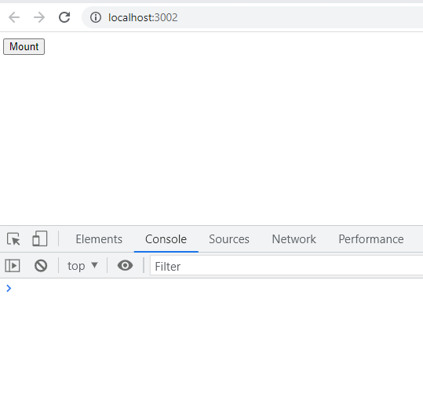
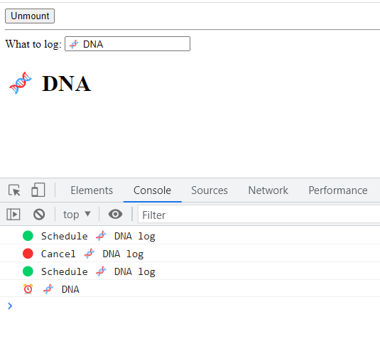
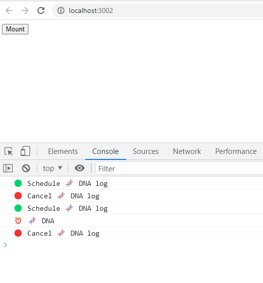
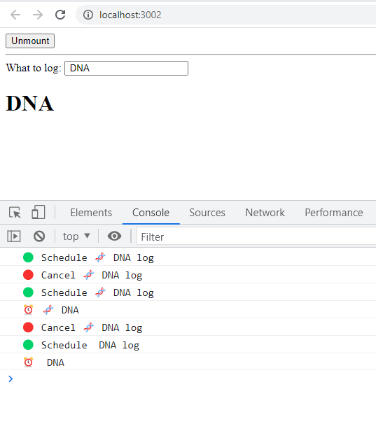

  <h1>Log useEffect Behaviour</h1>
  

    This repository explores how useEffect works in React.StrictMode
  

  

### Links

- [Click here to open site](https://log-use-effect-behaviour.netlify.app/)
- You will notice that in the link above the component mounts only when mount is clicked and once.

### Important points to consider

- The component will <strong>mount, unmount</strong> then <strong>remount</strong> when mount is clicked because of <strong>strict mode</strong> which helps developers find bugs early in the development process.

### Initial render

### When mount is clicked, react mounts, unmounts and remounts

### When unmount is clicked, the cleanup function is run

### When the value of text changes, react runs the cleanup function to unmount the component with the old value of text and then it remounts the component with the new value of text

